# Guide utilisateur — PROSIMMOBILIER

Version du guide : 24 août 2026  
Public concerné : visiteurs, agences immobilières, responsables, membres du personnel et administrateurs.

## 1. Présentation

PROSIMMOBILIER centralise la gestion d’une agence immobilière : propriétés, propriétaires, locataires, personnel, maintenance, caisse, reversements, statistiques, abonnements et assistance.

L’application comprend trois espaces :

- le site public, pour découvrir la solution et inscrire une agence ;
- l’espace Agence, pour les opérations quotidiennes ;
- l’espace Administration, pour piloter la plateforme.

## 2. Prérequis et accès

Utiliser une version récente de Google Chrome, Microsoft Edge, Firefox ou Safari. Une résolution d’au moins 1280 × 720 est conseillée sur ordinateur. Sur téléphone ou tablette, le menu s’adapte à la largeur disponible.

Adresses locales de développement :

- site public : `http://127.0.0.1:8000/` ;
- connexion Agence : `http://127.0.0.1:8000/agence/login` ;
- connexion Administration : `http://127.0.0.1:8000/admin/login`.

En production, remplacer cette adresse par le nom de domaine communiqué par l’administrateur.

Comptes de démonstration livrés avec les données d’exemple :

| Espace | Identifiant | Mot de passe |
|---|---|---|
| Agence | `agence.demo@pros-immobilier.test` | `Agence@12345` |
| Administration | `admin@pros-immobilier.test` | `Admin@12345` |

Ces identifiants sont réservés à l’environnement local ou de démonstration. Ils doivent être remplacés et ne doivent jamais être utilisés en production.

## 3. Inscrire une agence

1. Depuis l’accueil, choisir l’action d’inscription.
2. Renseigner les informations de l’agence, du responsable et de connexion.
3. Sélectionner le pays de l’entreprise. Ce pays devient le pays par défaut des champs téléphoniques de l’application ; le drapeau et l’indicatif restent modifiables lorsque le formulaire l’autorise.
4. Renseigner tous les champs marqués d’un astérisque `*`.
5. Accepter les conditions demandées, puis valider.
6. Après une inscription réussie, l’utilisateur est connecté et redirigé vers le tableau de bord de l’application, pas vers la page d’abonnement.

Si le formulaire affiche une erreur, corriger les champs signalés. Les messages sont présentés sous forme lisible, par exemple : « Le nom du membre est obligatoire », « L’adresse est obligatoire » ou « Le contact principal est obligatoire ».

## 4. Se connecter et se déconnecter

### Espace Agence

1. Ouvrir la page de connexion Agence.
2. Saisir l’adresse e-mail et le mot de passe.
3. Activer « Se souvenir de moi » uniquement sur un appareil privé.
4. Cliquer sur **Se connecter**.

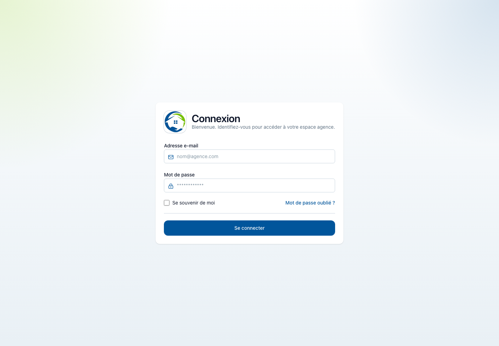

### Espace Administration

La procédure est identique depuis l’adresse Administration. Seuls les comptes administrateurs autorisés peuvent y accéder.

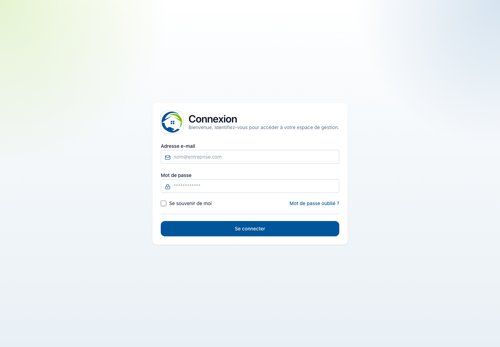

Pour quitter l’application, ouvrir le menu du compte en haut à droite puis choisir **Déconnexion**. Toujours se déconnecter sur un appareil partagé.

## 5. Principes communs aux formulaires

- Un astérisque `*` identifie un champ obligatoire.
- Les listes de sélection volumineuses comportent une zone de recherche. Cliquer dans le champ, saisir quelques lettres, puis choisir le résultat correspondant.
- Les champs téléphoniques utilisent un sélecteur de pays avec drapeau et indicatif. Le pays de l’entreprise est proposé par défaut.
- Les montants doivent être saisis sans texte ; l’application assure leur présentation en F CFA.
- Les documents acceptés dépendent du formulaire. Vérifier le format et la taille avant l’envoi.
- En cas d’erreur, les données valides restent normalement présentes. Corriger uniquement les champs signalés puis soumettre de nouveau.

## 6. Tableau de bord Agence

Après connexion, le tableau de bord résume les propriétés, portes, propriétaires, locataires, membres du personnel, montants attendus et encaissés, taux d’occupation et échéances.

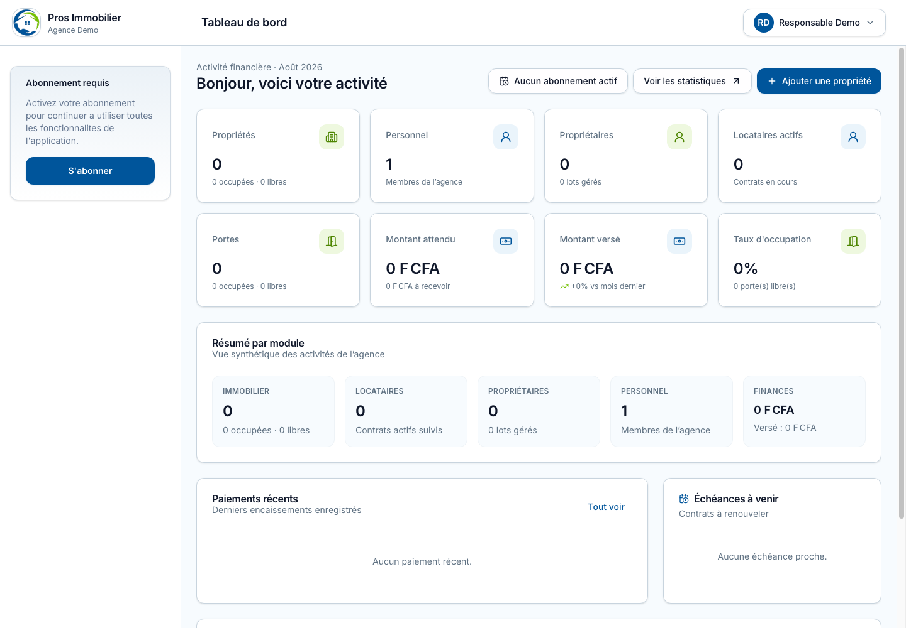

Le bloc de gauche signale l’état de l’abonnement. Les fonctionnalités disponibles dépendent de l’abonnement et des droits du compte connecté.

## 7. Propriétaires

### Ajouter un propriétaire

1. Ouvrir **Propriétaires** puis choisir **Ajouter**.
2. Renseigner l’identité ou la raison sociale, les coordonnées, l’adresse et les informations demandées.
3. Utiliser le sélecteur téléphonique pour confirmer le pays et l’indicatif.
4. Ajouter les documents utiles si nécessaire.
5. Enregistrer.

### Créer un lot pour le propriétaire

1. Ouvrir la fiche du propriétaire concerné.
2. Accéder à la partie **Lots**.
3. Choisir **Ajouter un lot**, renseigner ses informations puis enregistrer.
4. Le lot devient ensuite disponible dans le champ **Lot** du formulaire de création d’une propriété.

La création des lots s’effectue donc dans la partie **Propriétaire**, et non dans le formulaire de propriété.

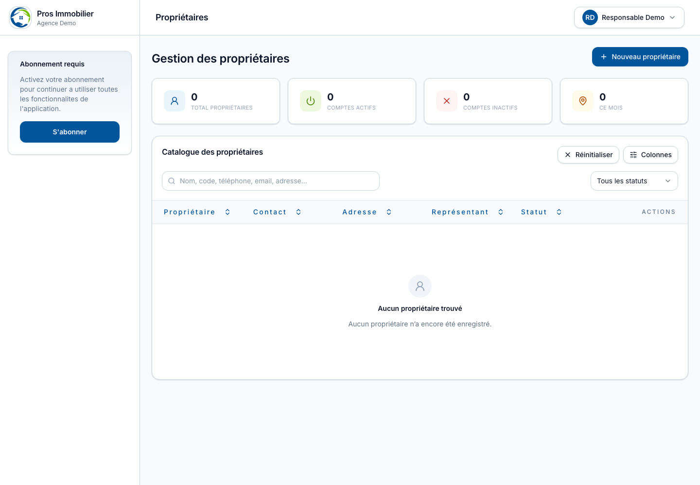

Depuis la fiche d’un propriétaire, il est possible de consulter ses lots, ses documents et les informations liées. Les documents disposent d’une présentation dédiée pour faciliter l’identification, l’ouverture et le téléchargement.

## 8. Propriétés, bâtiments et portes

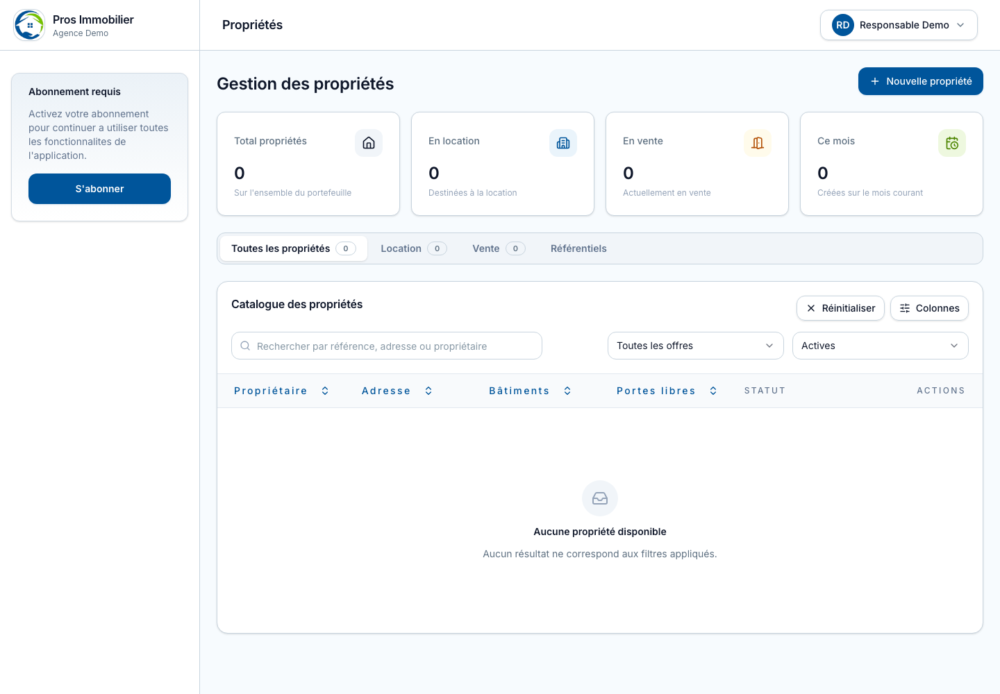

### Ajouter une propriété

1. Ouvrir **Propriétés** puis **Ajouter une propriété**.
2. À la première étape, sélectionner le propriétaire avec le champ de recherche.
3. Définir la stratégie : location uniquement, vente uniquement, ou location et vente selon les options proposées.
4. Renseigner l’adresse, le type, la désignation et les caractéristiques.
5. Ajouter les bâtiments et portes nécessaires.
6. Dans le champ **Lot**, rechercher et sélectionner un lot déjà créé depuis la fiche du propriétaire.
7. Vérifier le récapitulatif puis enregistrer.

Si le lot recherché est absent, revenir dans **Propriétaires**, ouvrir la fiche concernée et créer d’abord le lot.

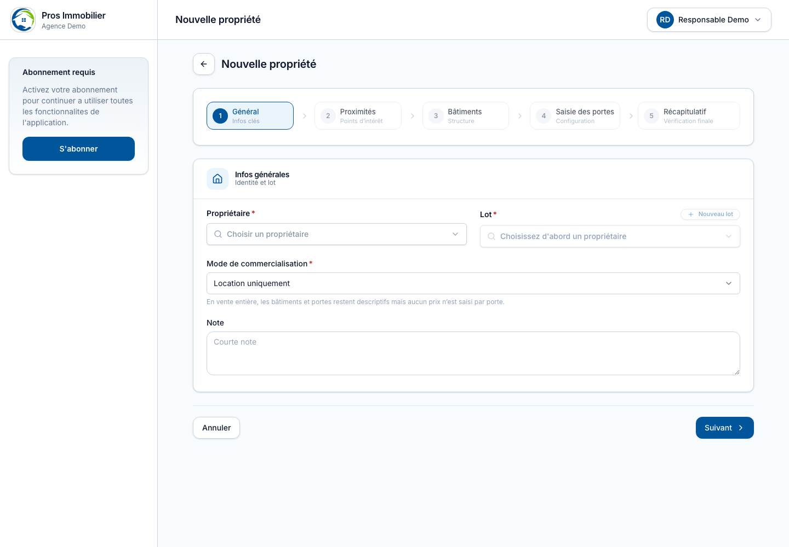

Règle importante : lorsque **Location uniquement** est choisie à la première étape, les étapes suivantes respectent ce choix. L’ajout d’une porte ou d’un lot ne propose donc pas de le mettre en vente.

Sur les écrans composés de deux cadres, la liste des bâtiments et la zone d’informations possèdent des défilements indépendants. La liste reste visible pendant la navigation dans le formulaire.

## 9. Locataires et contrats

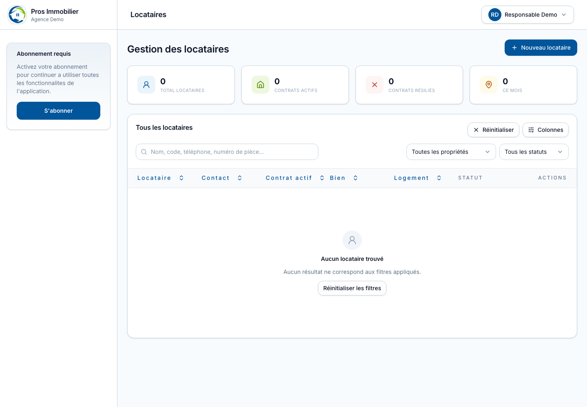

### Ajouter un locataire

1. Ouvrir **Locataires** puis choisir l’ajout.
2. Renseigner l’identité, le téléphone, l’adresse et les informations obligatoires.
3. Sélectionner la propriété et une porte libre.
4. Définir les dates, le loyer, la caution et les modalités du contrat.
5. Ajouter les documents demandés.
6. Vérifier puis enregistrer.

La fiche du locataire permet de consulter et mettre à jour ses informations, son contrat et ses documents, dans la limite des autorisations accordées.

## 10. Gestion du personnel

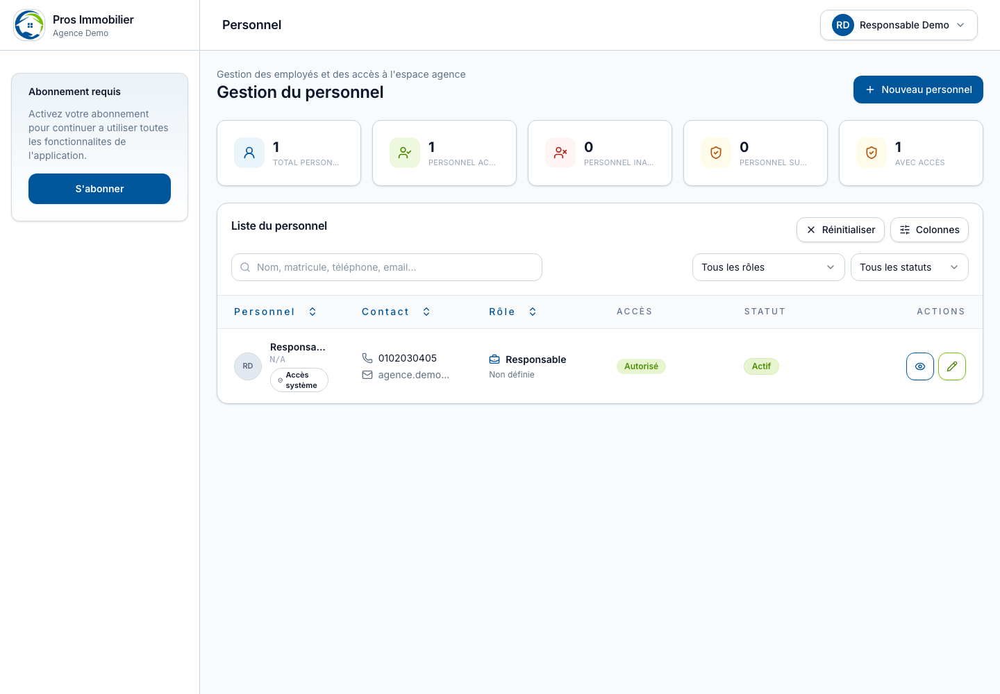

### Ajouter un membre

1. Ouvrir **Personnel** puis **Ajouter**.
2. Renseigner le nom, le contact, l’adresse e-mail et les autres champs obligatoires.
3. Pour le téléphone, choisir le pays grâce au drapeau puis saisir un numéro valide pour cet indicatif.
4. Choisir le rôle et les accès nécessaires.
5. Enregistrer et transmettre les informations de connexion de façon sécurisée.

Les accès du rôle **Responsable** sont affichés dans le tableau. Deux protections s’appliquent indépendamment des droits accordés :

- aucun utilisateur ne peut désactiver son propre compte ;
- personne ne peut désactiver le Responsable de l’agence.

Le bouton **Désactiver** est masqué lorsque l’action est interdite.

## 11. Profil et mot de passe

Ouvrir le menu du compte, puis **Profil**.

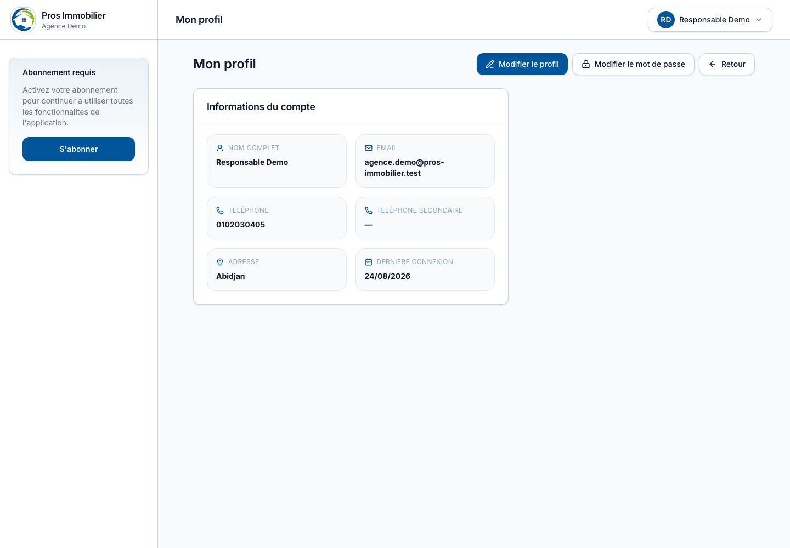

La page permet de modifier les informations qui concernent l’utilisateur connecté. Le changement de mot de passe est volontairement séparé du formulaire de profil :

1. modifier puis enregistrer les informations personnelles dans le premier formulaire ;
2. utiliser la section dédiée au mot de passe ;
3. saisir le mot de passe actuel, le nouveau mot de passe et sa confirmation ;
4. enregistrer le changement.

Choisir un mot de passe long, unique et difficile à deviner. Ne jamais le transmettre par messagerie non sécurisée.

## 12. Maintenance

Le module Maintenance permet de déclarer une intervention, préciser son type et sa priorité, affecter un maintenancier, suivre les tâches et faire évoluer le statut jusqu’à la clôture.

Procédure recommandée :

1. créer l’intervention avec une description précise ;
2. joindre les informations permettant d’identifier la propriété ou la porte ;
3. affecter le prestataire ou le membre concerné ;
4. actualiser le statut à chaque étape ;
5. enregistrer le coût et le paiement lorsque les travaux sont terminés.

## 13. Caisse et transactions

### Ouvrir la caisse

1. Ouvrir **Gestion financière / Caisse**.
2. Choisir **Ouvrir la caisse**.
3. Indiquer le solde d’ouverture puis confirmer.

Une caisse ouverte permet de tester ou d’enregistrer les entrées et sorties selon le mode actif. En mode démonstration, l’ouverture et la fermeture sont simulées pour permettre de parcourir tout le processus, mais elles ne créent pas d’enregistrement permanent.

### Ajouter un mouvement

1. Cliquer sur **Nouveau mouvement**.
2. Choisir le type, le libellé, le montant et le mode de paiement.
3. Vérifier les informations puis valider.

Dans la liste des transactions, la référence technique n’est pas affichée. Le libellé est présenté de façon lisible, sans données JSON brutes.

### Résumé par mode de paiement

Le résumé regroupe correctement les montants et le nombre de transactions pour chaque mode réellement utilisé. Un mode sans transaction sur la période sélectionnée n’est pas affiché.

### Fermer la caisse

1. Contrôler le solde théorique et les mouvements.
2. Cliquer sur **Fermer la caisse**.
3. Saisir les informations de clôture demandées puis confirmer.

## 14. Reversements

Le module Reversements sert à calculer et suivre la part de l’agence et la part revenant aux propriétaires. Avant validation :

1. sélectionner la période ;
2. contrôler les loyers encaissés et les éventuelles retenues ;
3. vérifier le propriétaire et le mode de règlement ;
4. enregistrer le reversement ;
5. conserver le justificatif produit.

## 15. Statistiques

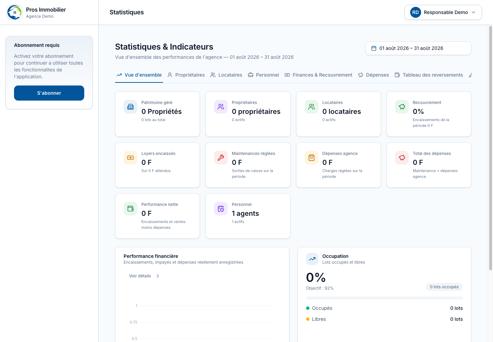

Les onglets de la section Statistiques restent sur une ligne lorsque l’espace disponible le permet. Sur un écran étroit, la présentation s’adapte au support. Utiliser les filtres de période et de module pour analyser les données pertinentes.

Dans **Performance financière**, les courbes sont contenues dans la zone du graphique. Si les données sont nombreuses, modifier la période plutôt que le zoom du navigateur afin de conserver une lecture fiable.

## 16. Abonnement et mode démonstration

Depuis **Mon abonnement**, consulter la formule, sa période, son état et les modules activés. Pour souscrire ou renouveler :

1. choisir la durée souhaitée ;
2. sélectionner les modules nécessaires ;
3. contrôler le récapitulatif et le montant total ;
4. continuer vers le paiement ;
5. revenir dans **Mon abonnement** pour vérifier l’activation.

Sans abonnement actif, un encart l’indique dans l’espace Agence. Une fonctionnalité peut être absente si son module n’est pas inclus dans la souscription.

Le mode démonstration permet d’explorer les écrans et de simuler des opérations prévues, notamment l’ouverture et la fermeture de caisse. Les actions signalées comme non persistantes ne modifient pas les données permanentes.

## 17. Paramétrage

La partie **Paramétrage** permet de gérer l’identité et les coordonnées de l’agence, la devise, la facturation, les logos et cachets, les signatures, les notifications ainsi que les rôles et permissions. Sélectionner la rubrique dans le panneau gauche, effectuer les modifications puis enregistrer avant de changer de rubrique.

## 18. Annonces

Pour informer les locataires :

1. ouvrir **Annonces** et saisir un titre et un message ;
2. choisir tous les locataires, une propriété, un bâtiment ou un locataire précis ;
3. utiliser les champs de recherche pour sélectionner la cible ;
4. vérifier les destinataires puis publier ;
5. consulter le nombre de destinataires et d’annonces non lues.

## 19. Support

Pour signaler un incident :

1. ouvrir **Support**, puis choisir **Nouvelle demande** ;
2. donner un titre explicite ;
3. préciser le module, la date, l’action effectuée et le message observé ;
4. joindre une capture sans mot de passe ni donnée confidentielle ;
5. envoyer puis suivre les réponses dans le ticket.

## 20. Administration de la plateforme

### Tableau de bord

Le tableau de bord Administration présente les revenus, abonnements actifs, paiements en attente, alertes et évolutions récentes.

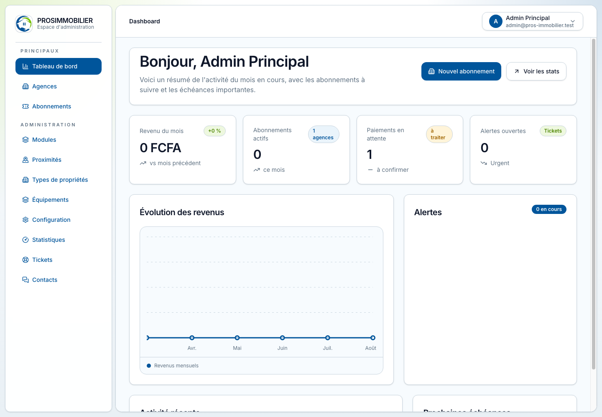

### Agences

La section **Agences** permet de rechercher une agence, consulter sa fiche, contrôler son état et accéder aux actions autorisées.

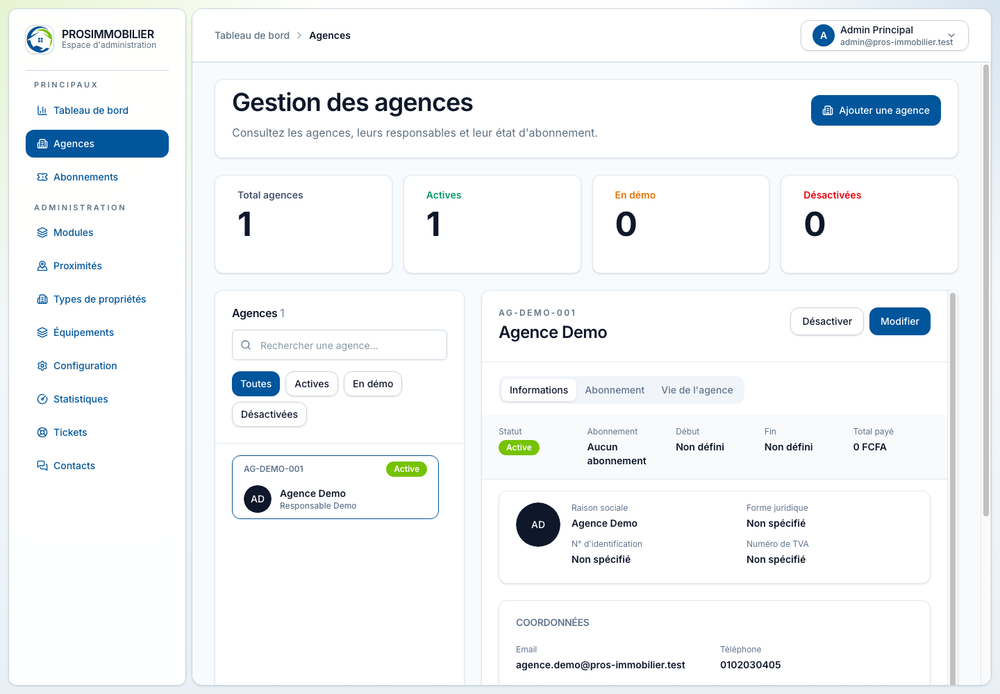

### Abonnements

La section **Abonnements** permet de créer une souscription, suivre son statut, contrôler ses dates et gérer son évolution.

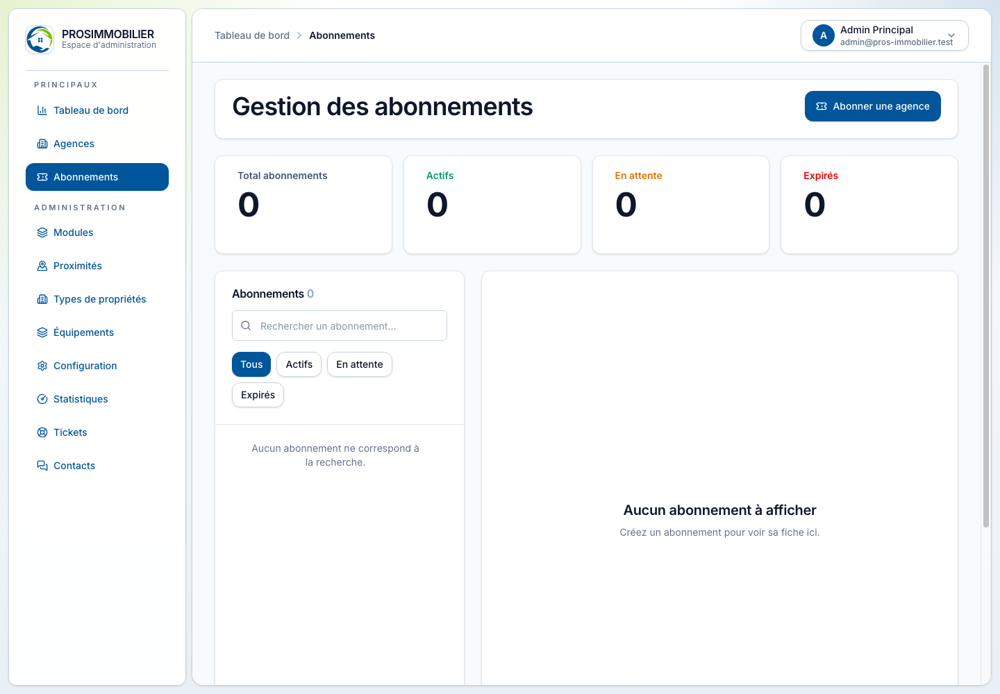

### Configuration et référentiels

Les rubriques **Modules**, **Proximités**, **Types de propriétés**, **Équipements** et **Configuration** alimentent les listes utilisées par les agences. Avant de supprimer un élément, vérifier qu’il n’est pas utilisé par des données existantes.

### Statistiques administratives

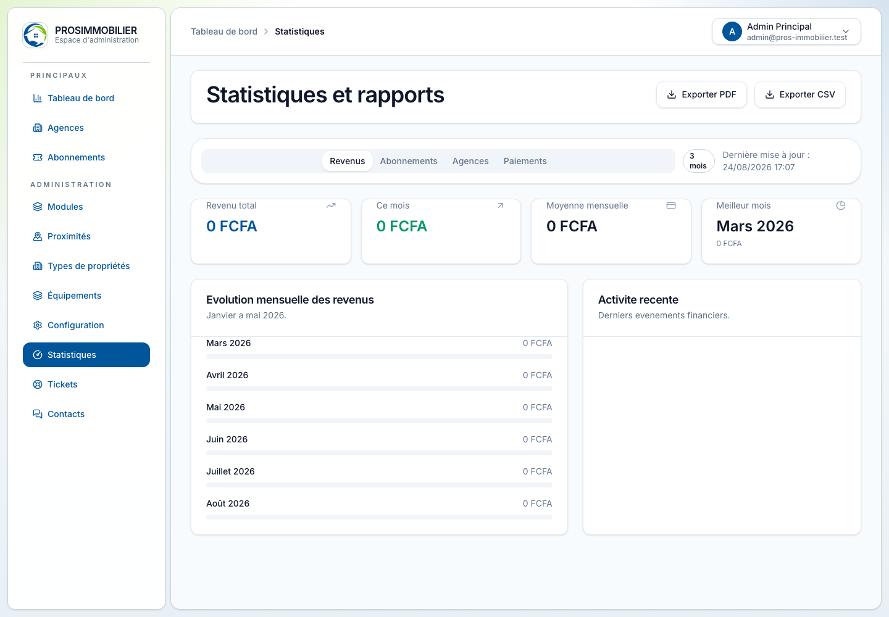

Utiliser les filtres disponibles pour contrôler l’activité globale, les abonnements et les revenus. Les graphiques sont dimensionnés pour conserver leurs courbes dans leur zone d’affichage.

### Tickets et contacts

Traiter les demandes avec leur contexte, leur priorité et leur statut. Ne jamais demander à un utilisateur son mot de passe.

## 19. Bonnes pratiques de sécurité

- Utiliser un compte nominatif par personne.
- Accorder uniquement les accès nécessaires au rôle.
- Verrouiller ou fermer la session avant de quitter le poste.
- Vérifier le destinataire avant de télécharger ou partager un document.
- Ne pas réutiliser le mot de passe de l’application sur un autre service.
- Désactiver rapidement le compte d’un collaborateur sortant, sauf lorsqu’il s’agit du Responsable protégé ; dans ce cas, effectuer d’abord le transfert de responsabilité prévu par l’administration.
- Ne jamais saisir de données réelles sensibles dans un environnement de démonstration.

## 20. Dépannage rapide

| Situation | Vérification ou solution |
|---|---|
| La page ne s’affiche pas | Actualiser, vérifier la connexion réseau puis essayer dans une fenêtre privée. |
| Connexion refusée | Vérifier l’espace choisi, l’adresse e-mail, le mot de passe et le verrouillage des majuscules. |
| Une liste semble vide | Effacer le texte de recherche et contrôler les filtres actifs. |
| Un lot ou une porte est absent | Vérifier le propriétaire, la propriété, le statut libre/occupé et la stratégie location/vente. |
| Un bouton est absent | Le rôle, l’abonnement ou une règle de sécurité peut interdire l’action. |
| Le téléphone est refusé | Vérifier le drapeau, l’indicatif et le nombre de chiffres attendu pour le pays. |
| Un mode de paiement n’apparaît pas | Dans le résumé, seuls les modes utilisés sur la période sont affichés. |
| Une donnée de démonstration disparaît | Certaines actions de démonstration sont simulées et ne sont pas enregistrées. |

Si le problème persiste, transmettre au support l’URL de la page, l’heure, le rôle utilisé, les étapes de reproduction et une capture d’écran expurgée de toute donnée confidentielle.
